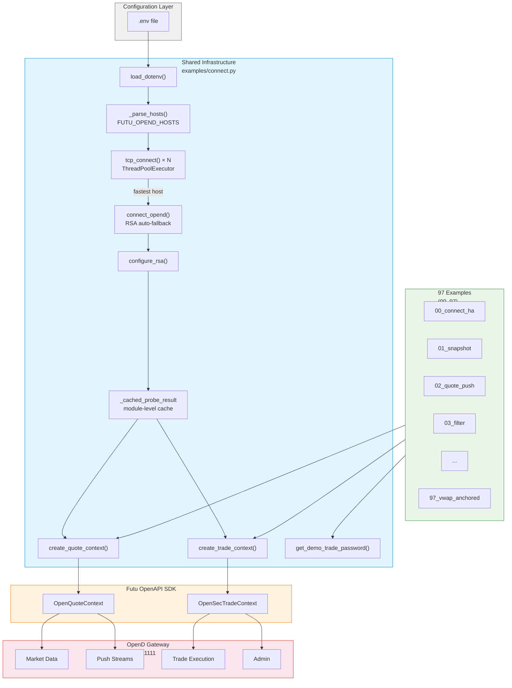
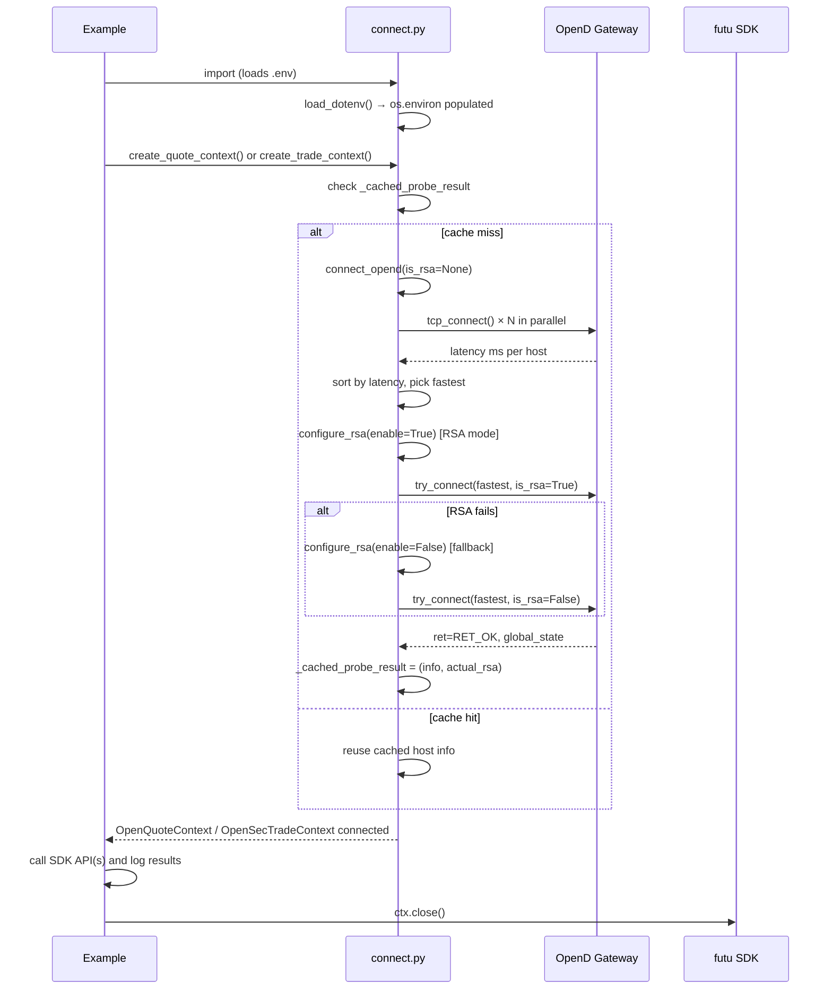
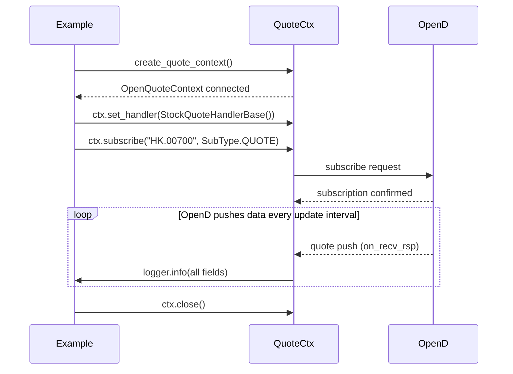
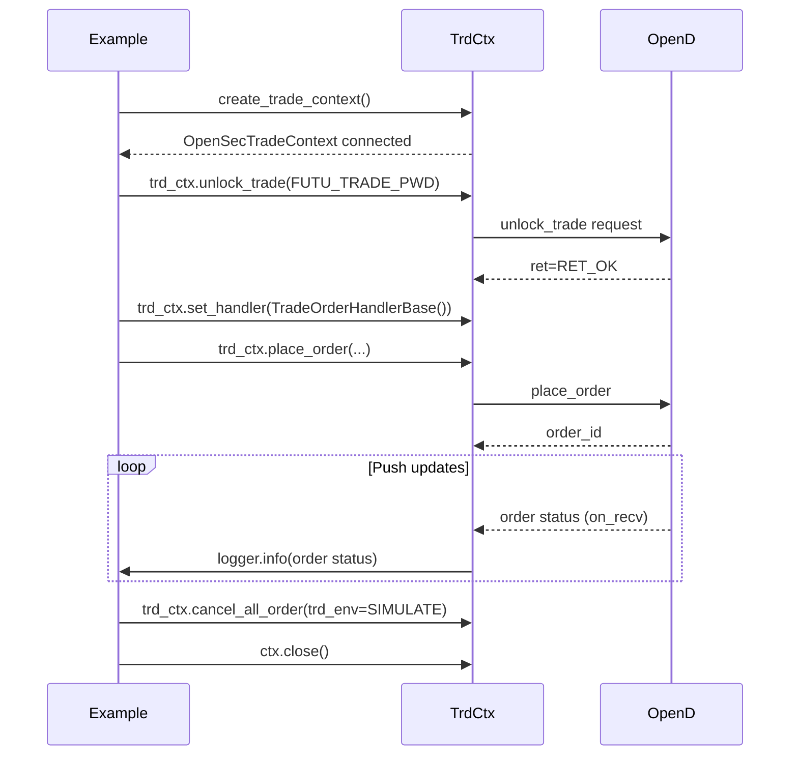
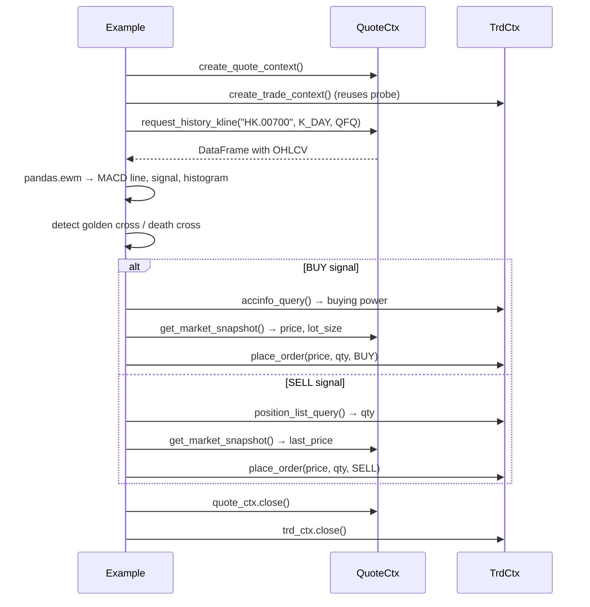
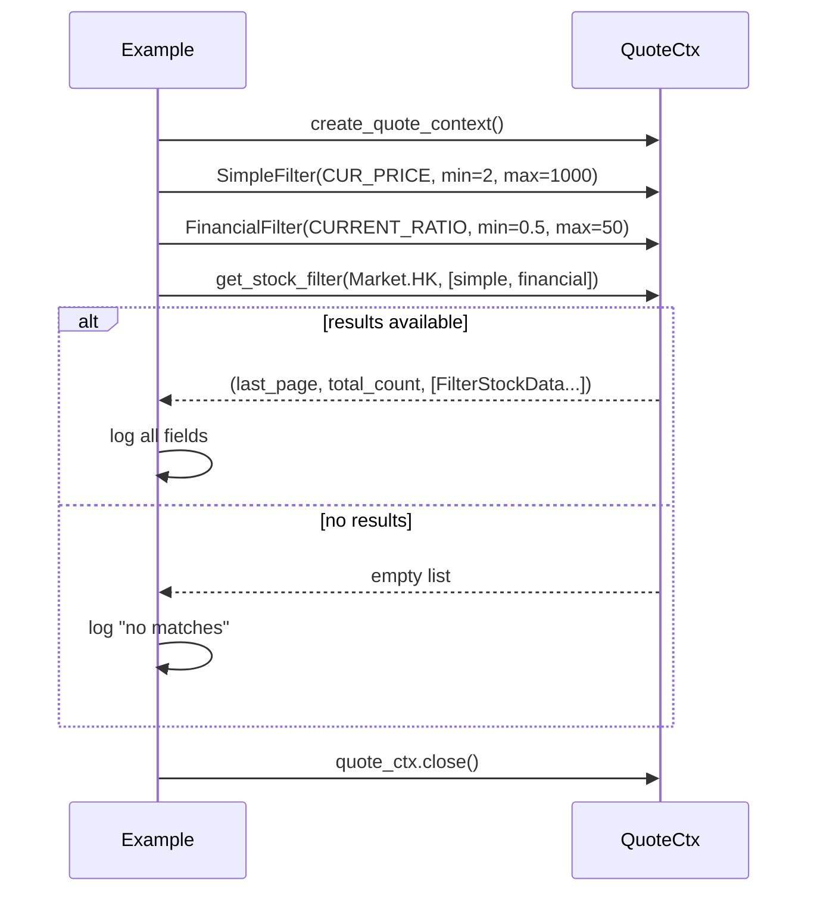

# Architecture

> Built on the [Futu OpenAPI Python SDK](https://openapi.futunn.com/futu-api-doc/). 97 standalone examples organized as a reference library, not a framework.

## Codebase at a Glance (Knowledge Graph)

| Metric | Value |
|--------|-------|
| Files | 155 |
| Python modules | 136 (99 main.py, 37 supporting modules) |
| Code symbols | 3,180 |
| Relationships | 4,390 |
| Functional communities | 59 |
| Execution flows | 99 |

**Layer architecture:**

```
┌────────────────────────────────────────────────────────┐
│                  97 Example Scripts                     │
│  (00_connect_ha/  →  examples/97_vwap_anchored/)       │
│  Each: import connect → call SDK → log → ctx.close()   │
└──────────────────────┬─────────────────────────────────┘
                       │ imports from
┌──────────────────────▼─────────────────────────────────┐
│              examples/connect.py                        │
│  HA gateway probe │ RSA config │ connection cache       │
└───────┬──────────────────────────────┬──────────────────┘
        │ create_quote_context         │ create_trade_context
┌───────▼──────────┐          ┌───────▼──────────┐
│ OpenQuoteContext │          │OpenSecTradeContext│
│ (quote/trade ctx)│          │  (trade ctx only) │
└───────┬──────────┘          └───────┬──────────┘
        │                              │
┌───────▼──────────────────────────────▼──────────────────┐
│              Futu OpenD Gateway (TCP :11111)             │
│  Market data │ Push streams │ Order execution │ Admin   │
└─────────────────────────────────────────────────────────┘
```

## Overview

The repo has two distinct layers:

| Layer | Contents | KG Evidence |
|-------|----------|------------|
| **SDK Examples** | 97 example scripts (`examples/00`–`examples/97`), each demonstrating one Futu API feature | 99 `main.py` files indexed as separate communities |
| **Shared Infrastructure** | `examples/connect.py` — HA gateway selection, connection caching, env-var loading | `create_quote_context` has 30+ callers across the example graph |

All 97 examples follow the same pattern:

1. **Import** `connect.py` (loads `.env`, populates environment)
2. **Create context(s)** via `create_quote_context()` / `create_trade_context()` (triggers TCP probe, RSA setup)
3. **Call SDK API** — one or more Futu OpenAPI methods
4. **Log** all response fields
5. **Clean up** — `ctx.close()` in `try/finally`

The knowledge graph confirms this as the dominant execution flow: all 99 processes follow the `Main → Configure_rsa` chain.

## System Architecture (Mermaid)



## Functional Areas

### 1. Shared Infrastructure — HA Gateway Connection

**Files:** `examples/connect.py`, `examples/00_connect_ha/main.py`

`connect.py` is the backbone — every example (except `00`) imports it. The knowledge graph shows it's the single most-impacted module with 30+ direct callers.

| Symbol | Role | KG Stats |
|--------|------|----------|
| `load_dotenv()` | Auto-loads `.env` on import | Runs at module import time |
| `_parse_hosts()` | Parse `FUTU_OPEND_HOSTS` → `[(host, port, is_rsa), ...]` | Called once at module init |
| `tcp_connect()` | Parallel TCP probe via `ThreadPoolExecutor` | Returns latency in ms |
| `connect_opend()` | Sort by latency, connect fastest, RSA auto-fallback | Core orchestrator — called by both context creators |
| `configure_rsa()` | Set `SysConfig.enable_proto_encrypt()` before each connect | Terminal step in every execution flow |
| `_cached_probe_result` | Module-global cache shared between quote and trade contexts | Eliminates redundant probes |
| `create_quote_context()` | Returns connected `OpenQuoteContext` — probes if no cache hit | Called by 30+ examples |
| `create_trade_context()` | Returns `OpenSecTradeContext` — reuses cached probe | Called by 19 trade examples |
| `get_demo_trade_password()` | Returns `FUTU_TRADE_PWD` from env | Called by 14 trade examples |

**KG-verified connection flow (step-by-step from 99 processes):**

```
1. import connect                  → triggers load_dotenv(), _parse_hosts()
2. create_quote_context()           → checks _cached_probe_result
3.   ├── cache hit → reuse existing host info, configure_rsa(), return ctx
4.   └── cache miss → connect_opend()
5.         ├── tcp_connect() × N    → parallel probe all hosts
6.         ├── sort by TCP latency  → pick fastest
7.         ├── try_connect(RSA)     → attempt with RSA
8.         ├── [if fails & auto]    → try_connect(no RSA)
9.         └── cache result         → save for trade context reuse
10. configure_rsa()                 → SysConfig.set_init_rsa_file()
11. OpenQuoteContext(host, port)    → return connected ctx
```

### 2. Market Data — Snapshot, K-Line, Ticker, Order Book

**Examples:** 01, 07, 08, 10, 14, 16, 36, 42, 44, 55

Core quote APIs for price/volume/depth data. All use `OpenQuoteContext`.

| API | KG Callers Count | Used By |
|-----|-----------------|---------|
| `get_market_snapshot()` | ~10 | 01_snapshot, 44_multi_market, 55_momentum |
| `get_stock_quote()` | ~20 | 16_stock_quote, 62_portfolio_risk, 90_ah_premium |
| `request_history_kline()` | ~8 | 07_kline, 64_backtesting, 94_earnings_analyzer |
| `get_cur_kline()` | ~6 | 14_cur_kline, 69_bollinger_bounce |
| `get_rt_ticker()` | ~4 | 08_rt_ticker, 59_dark_pool_detector |
| `get_order_book()` | ~8 | 10_orderbook, 61_twap_slicer, 74_orderflow_viz |
| `get_stock_basicinfo()` | ~5 | 36_stock_basicinfo, 20_ipo_list |

**Subscription model:**
```
subscribe(code, SubType.QUOTE)       → real-time push
subscribe(code, SubType.ORDER_BOOK)  → order book depth
subscribe(code, SubType.TICKER)      → tick-by-tick trades
subscribe(code, SubType.BROKER)      → broker queue
subscribe(code, SubType.K_DAY)       → daily K-line push
query_subscription()                 → list active subs
unsubscribe(code_list, subtype_list) → tear down
```

### 3. Push Handlers — Real-Time Streaming

**Examples:** 02, 05, 14, 39, 40, 45–48, 56, 71, 72, 74, 77

Two handler patterns verified by the knowledge graph:

**Pattern A — Quote handlers** (protobuf → `on_recv_rsp(rsp_pb)`):

| Handler | Push Content | Examples |
|---------|-------------|----------|
| `StockQuoteHandlerBase` | Real-time quote fields | 02, 05, 60, 62 |
| `CurKlineHandlerBase` | Live K-line bar updates | 14, 46, 54 |
| `TickerHandlerBase` | Tick-by-tick trades | 02, 05, 45b |
| `OrderBookHandlerBase` | Bid/ask depth ladder | 02, 56, 74 |
| `BrokerHandlerBase` | Broker queue changes | 45, 59 |
| `SysNotifyHandlerBase` | Login/disconnect events | 39 |
| `PriceReminderHandlerBase` | Price alert triggers | 47 |

**Pattern B — Trade handlers** (string → `on_recv(rsp_str)`):

| Handler | Push Content | Examples |
|---------|-------------|----------|
| `TradeOrderHandlerBase` | Order status changes | 40, 88 |
| `TradeDealHandlerBase` | Trade execution confirmations | 40 |
| `KeepAliveHandlerBase` | Connection heartbeat | 48 |

**Handler lifecycle (common across all):**
```
ctx.set_handler(HandlerClass())  → register
ctx.subscribe(code, subtype)     → activate
# OpenD pushes as events occur
ctx.close()                      → deregister
```

### 4. Stock Screener

**Examples:** 03, 29, 52, 55, 82, 85, 86

| Filter Component | Purpose | Examples |
|-----------------|---------|----------|
| `SimpleFilter` | Price, volume, turnover, amplitude ranges | 03, 86 |
| `FinancialFilter` | P/E, P/B, market cap, dividend yield | 03 |
| `AccumulateFilter` | Unusual volume/price spike detection | 29, 82 |
| `CustomIndicatorFilter` | RSI, MACD, technical indicators | 55 |
| `OptionDataFilter` | Delta, IV, moneyness, OI | 52 |
| `get_stock_filter()` | Combined screener (paginated) | 03 |

### 5. Trade Execution (SIMULATE Only)

**Examples:** 04, 06, 11, 32–35, 37–40, 54, 57, 61, 66, 68, 69, 76, 78–81, 88, 92, 93, 96

All trade examples use SIMULATE account exclusively. The knowledge graph shows `get_demo_trade_password()` is called by 14 examples.

| API | Purpose | Called From |
|-----|---------|-------------|
| `unlock_trade(pwd)` | Unlock SIMULATE trading | 04, 06, 11, 61, 66, 68, 78, 88 |
| `place_order()` | Submit buy/sell (SIMULATE) | 06, 61, 66, 78, 79, 88 |
| `modify_order()` | Update price/qty | 06, 32 |
| `cancel_order()` | Cancel single order | 32, 88 |
| `cancel_all_order()` | Emergency cleanup | 34, 66, 88 |
| `order_list_query()` | Query open/historical orders | 32, 50, 66, 88 |
| `deal_list_query()` | Query trade executions | 32, 50 |
| `accinfo_query()` | Account cash/buying power | 11, 62, 81 |
| `position_list_query()` | Current holdings | 11, 62, 79, 81 |
| `acctradinginfo_query()` | Max buy/sell quantity | 33 |
| `order_fee_query()` | Fee calculation | 38 |

### 6. Market Reference Data

**Examples:** 09, 12, 13, 17–22, 25–28, 31, 41, 70, 75, 83

| API | Data Returned | Examples |
|-----|---------------|----------|
| `get_broker_queue()` | Broker bid/ask depth by level | 09, 59 |
| `get_trading_days()` | Market open days calendar | 12 |
| `get_plate_list()` | All sectors/industries per market | 13, 91 |
| `get_plate_stock()` | Stocks belonging to a plate | 13, 91 |
| `get_owner_plate()` | Which plate owns a stock | 17 |
| `get_capital_flow()` | Intraday/daily money flow heatmap | 19, 42 |
| `get_option_chain()` | Option strikes + Greeks by expiry | 25, 52, 58, 65, 85 |
| `get_warrant()` | Warrant data by underlying | 28, 70 |
| `get_future_info()` | Futures specs (size, tick, hours) | 21, 75 |
| `get_market_state()` | Pre-open/open/closed per market | 22 |
| `get_history_kl_quota()` | Daily K-line quota remaining | 26 |
| `get_code_change()` | Stock rename/split history | 27 |
| `get_rehab()` | Ex-dividend/ex-right dates | 41 |
| `get_ipo_list()` | Upcoming IPOs per market | 20 |

### 7. User & Watchlist Management

**Examples:** 23, 24, 30, 31, 51, 87

| API | Purpose |
|-----|---------|
| `set_price_reminder()` | Create price alert |
| `get_price_reminder()` | List all price alerts |
| `update_price_reminder()` | Enable/disable alert |
| `get_user_security_group()` | List watchlist groups |
| `modify_user_security()` | Add/remove stocks from watchlist |
| `get_account_list()` | List all trading accounts |
| `get_user_info()` | User info and broker firm |

### 8. Advanced Analytics & Computation

**Examples:** 58, 64, 65, 85, 92

These examples perform server-side computation without placing orders:

| Example | Computation | Libraries |
|---------|-------------|-----------|
| 58 — Options Greeks | Black-Scholes delta/gamma/theta/vega/rho | `math.erf`, stdlib only |
| 64 — Backtesting | SMA/RSI/MACD strategies, Sharpe, drawdown | `pandas`, stdlib |
| 65 — Vol Surface | Moneyness × expiry IV matrix | `pandas` |
| 85 — Vol Skew | Newton-Raphson IV solver | `math`, stdlib |
| 92 — Monte Carlo | 10K path VaR simulation | `random`, stdlib |

### 9. Screening & Detection

**Examples:** 63, 72, 73, 82, 83, 86, 89, 91, 94, 95

Signal generation and anomaly detection:

| Example | Method |
|---------|--------|
| 63 — Earnings Screener | Pre-earnings IV/HV ratio, post-earnings unusual activity |
| 72 — Candlestick Scanner | 9 classic candlestick patterns with confidence scoring |
| 73 — Correlation Tracker | Rolling Pearson matrix, spike detection |
| 82 — Unusual Options | Volume anomaly flagging |
| 86 — Market Breadth | Adv/Decline, McClellan Oscillator |
| 89 — Gap Scanner | Overnight gap with volume confirmation |
| 91 — Sector Rotation | RSI-based sector ranking |
| 94 — Earnings Analyzer | EPS surprise detection + post-earnings activity |
| 95 — 52-Week Scanner | Proximity to yearly extremes with volume |

### 10. Algorithmic Execution (SIMULATE)

**Examples:** 61, 66, 68, 69, 76, 78, 79, 80, 81, 88, 93, 97

Automated execution strategies — all SIMULATE-only:

| Example | Strategy |
|---------|----------|
| 61 — TWAP Slicer | Time-weighted average price execution |
| 66 — Multi-Leg Order | Vertical call spread |
| 68 — Trailing Stop | Dynamic stop-loss following price |
| 69 — Bollinger Bounce | Mean reversion via pure-Python Bollinger Bands |
| 76 — Kelly Sizer | Kelly Criterion position sizing |
| 78 — Grid Trading | Automated buy-low/sell-high grid |
| 79 — Pairs Trading | Engle-Granger cointegration stat-arb |
| 80 — Multi-Leg Options | Straddle, strangle, iron condor |
| 81 — Portfolio Rebalance | Periodic target-allocation rebalancing |
| 88 — SL/TP Engine | Dual stop-loss/take-profit with partial exits |
| 93 — Calendar Spread | Neutral theta plays via vol differential |
| 97 — VWAP Anchored | VWAP-based support/resistance signals |

## Key Execution Flows

### Flow 1: HA Gateway Connection (99 processes follow this)

The knowledge graph shows this is the universal entry point — every example process follows the `Main → Configure_rsa` chain.



### Flow 2: Real-Time Quote Push



### Flow 3: Trade Order Lifecycle (SIMULATE)



### Flow 4: MACD Strategy (Backtest + Trade)



### Flow 5: Stock Screener



## Directory Structure

```
futu-python-samples/
├── .env.example                     ← config template (copy to .env)
├── CHANGELOG.md                     ← version history v1.0.0–v1.5.0
├── ARCHITECTURE.md                  ← this file
├── CONTRIBUTING.md                  ← how to add examples
├── TROUBLESHOOTING.md               ← common problems and fixes
├── AGENTS.md                        ← AI coding tool reference
├── PLANS.md                         ← implementation plans (all complete)
│
├── examples/
│   ├── connect.py                   ← HA gateway helper (shared by all examples)
│   ├── README.md                    ← full 97-example categorized index
│   │
│   ├── 00_connect_ha/               ← standalone HA algorithm
│   ├── 01_snapshot/                 ← get_market_snapshot
│   ├── 02_quote_push/               ← all quote push handlers
│   ├── 03_filter/                   ← get_stock_filter
│   ├── 04_macd_strategy/            ← MACD + simulated orders
│   ├── 05_quote_trade/              ← all push handlers combined
│   │...
│   ├── 58_options_greeks/           ← Black-Scholes Greeks dashboard
│   ├── 59_dark_pool_detector/       ← TICKER+BROKER cross-reference
│   ├── 60_cross_market_arb/         ← HK/US dual-listing spread
│   ├── 61_twap_slicer/              ← TWAP algorithmic execution
│   ├── 62_portfolio_risk/           ← 6 risk metrics monitor
│   ├── 63_earnings_screener/        ← IV/HV + unusual activity
│   ├── 64_backtesting/              ← SMA/RSI/MACD backtest framework
│   ├── 65_vol_surface/              ← volatility surface matrix
│   ├── 66_multi_leg_order/          ← vertical call spread
│   ├── 67_health_monitor/           ← connection watchdog
│   │
│   ├── 68_trailing_stop/            ← dynamic trailing stop-loss
│   ├── 69_bollinger_bounce/         ← Bollinger Band mean reversion
│   ├── 70_warrant_valuation/        ← BSM implied vol + mispricing
│   ├── 71_market_regime/            ← ADX + rolling vol classification
│   ├── 72_candlestick_scanner/      ← 9 classic pattern detectors
│   ├── 73_correlation_tracker/      ← rolling Pearson matrix
│   ├── 74_orderflow_viz/            ← ASCII order flow imbalance chart
│   ├── 75_futures_term_structure/   ← dynamic futures discovery
│   ├── 76_kelly_sizer/              ← Kelly Criterion position sizing
│   ├── 77_iceberg_detector/         ← heuristic iceberg detection
│   ├── 78_grid_trading/             ← automated buy-low/sell-high grid
│   ├── 79_pairs_trading/            ← Engle-Granger cointegration
│   ├── 80_multi_leg_options/        ← straddle/strangle/iron condor
│   ├── 81_portfolio_rebalance/      ← target allocation rebalancing
│   ├── 82_unusual_options/          ← volume anomaly scanner
│   ├── 83_dividend_tracker/         ← dividends/corporate actions
│   ├── 84_vwap_analysis/            ← execution quality vs VWAP
│   ├── 85_vol_skew/                 ← IV skew surface Newton-Raphson
│   ├── 86_market_breadth/           ← Adv/Dec/McClellan oscillator
│   ├── 87_watchlist_alerts/         ← price/RSI/Bollinger alerts
│   ├── 88_sl_tp_engine/             ← SL/TP with partial exits
│   ├── 89_gap_scanner/              ← overnight gap detection
│   ├── 90_ah_premium/               ← A-share vs H-share premium
│   ├── 91_sector_rotation/          ← RSI-based sector ranking
│   ├── 92_monte_carlo/              ← 10K path VaR simulation
│   ├── 93_calendar_spread/          ← options calendar spread
│   ├── 94_earnings_analyzer/        ← EPS surprise analysis
│   ├── 95_52week_scanner/           ← 52-week extreme proximity
│   ├── 96_margin_monitor/           ← margin utilization monitor
│   └── 97_vwap_anchored/            ← VWAP support/resistance signals
│
└── scripts/
    ├── run_all.py                   ← automated PASS/FAIL test runner
    └── test_all.sh                  ← quick smoke test
```

## SDK Reference

- **Docs**: https://openapi.futunn.com/futu-api-doc/
- **Package**: `futu-api` (PyPI)
- **Version**: `10.5.6508`

### Key Handler Base Classes

| Class | Push type | Callback signature | Prototype |
|-------|-----------|-------------------|-----------|
| `StockQuoteHandlerBase` | Real-time quote | `on_recv_rsp(rsp_pb)` | Protobuf |
| `CurKlineHandlerBase` | K-line bar | `on_recv_rsp(rsp_pb)` | Protobuf |
| `RTDataHandlerBase` | Intraday minute data | `on_recv_rsp(rsp_pb)` | Protobuf |
| `TickerHandlerBase` | Tick-by-tick | `on_recv_rsp(rsp_pb)` | Protobuf |
| `OrderBookHandlerBase` | Order book depth | `on_recv_rsp(rsp_pb)` | Protobuf |
| `BrokerHandlerBase` | Broker queue | `on_recv_rsp(rsp_pb)` | Protobuf |
| `SysNotifyHandlerBase` | System notification | `on_recv_rsp(rsp_pb)` | Protobuf |
| `PriceReminderHandlerBase` | Price alert | `on_recv_rsp(rsp_pb)` | Protobuf |
| `TradeOrderHandlerBase` | Order status | `on_recv(rsp_str)` | String |
| `TradeDealHandlerBase` | Trade execution | `on_recv(rsp_str)` | String |
| `KeepAliveHandlerBase` | Heartbeat | `on_recv_rsp(rsp_pb)` | Protobuf |

### Key SubTypes for Subscription

`QUOTE` · `ORDER_BOOK` · `TICKER` · `BROKER` · `RT_DATA` · `K_DAY` · `K_1M`–`K_60M` · `K_WEEK` · `K_MON` · `K_QUARTER` · `K_YEAR`

## Appendix: Knowledge Graph Structure

The codebase is indexed by [GitNexus](https://github.com/anomalyco/gitnexus) with the following graph composition:

| Node Type | Count | Role |
|-----------|-------|------|
| `File` | 155 | All project files |
| `Function` | ~1,200 | Named functions across examples |
| `Class` | ~100 | Strategy classes, handlers, data models |
| `Method` | ~400 | Methods on handler classes |
| `Community` | 59 | Example-level functional groups |
| `Process` | 99 | Execution flows (one per example) |

**Edge types:** `CALLS` · `IMPORTS` · `EXTENDS` · `IMPLEMENTS` · `HAS_METHOD` · `ACCESSES` · `CONTAINS` · `STEP_IN_PROCESS`

**Dominant execution flow:** `Main → configure_rsa` — all 97 examples follow this 5-step chain:
1. Import `connect.py`
2. Load environment (`.env`)
3. `create_quote_context()` / `create_trade_context()`
4. `connect_opend()` → TCP probe → RSA handshake
5. `configure_rsa()` — terminal step before SDK context creation
