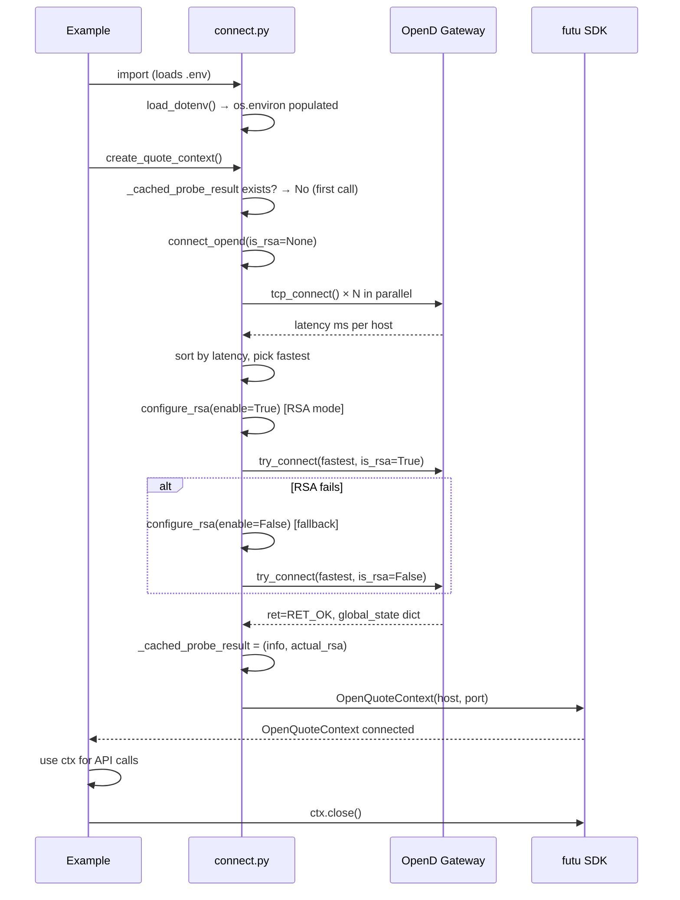
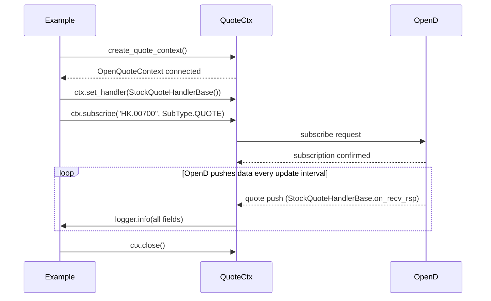
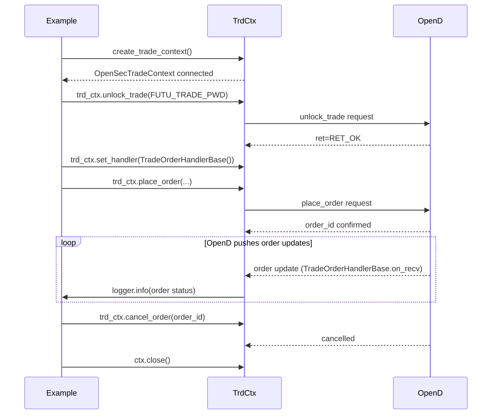
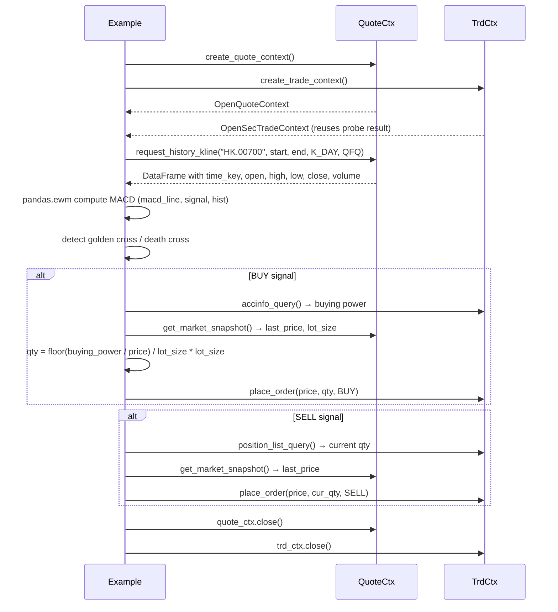
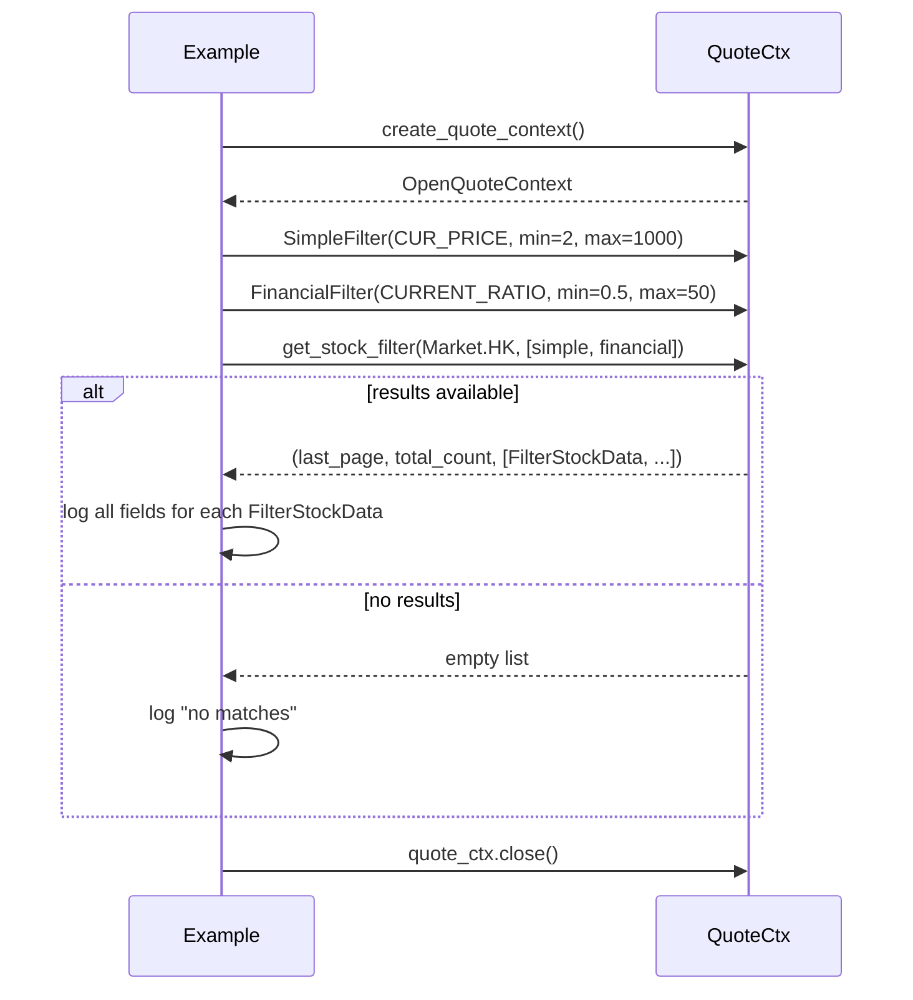

# Architecture

> Built on the [Futu OpenAPI Python SDK](https://openapi.futunn.com/futu-api-doc/). 87 standalone examples organized as a reference library, not a framework.

## Overview

The repo has two distinct layers:

| Layer | Contents |
|-------|----------|
| **SDK Examples** | 87 example scripts (`examples/00` – `examples/87`), each demonstrating one Futu API feature |
| **Shared Infrastructure** | `examples/connect.py` — HA gateway selection, connection caching, env-var loading |

```
futu-api (external SDK)
    │
    ▼
examples/connect.py          ← HA gateway, RSA config, connection cache, .env loading
    │
    ├──► OpenQuoteContext    ← all quote examples (01–41 + 42–57 + 58–87)
    └──► OpenSecTradeContext ← all trade examples (04, 05, 06, 11, 30, 32–35, 37–40, 61, 62, 64, 66, 68, 69, 70, 76, 78, 79, 80, 81)
    │
    ▼
87 example scripts (examples/00_connect_ha/ → examples/87_watchlist_alerts/)
  each: import connect → call SDK → log all response fields → try/finally ctx.close()
```

**Key stats**: 100+ files · 1200+ code symbols · 1600+ relationships · 40 functional communities · 45 execution flows

## Functional Areas

### 1. Connection Architecture (HA Gateway)

**Files**: `examples/connect.py`, `examples/00_connect_ha/main.py`

`connect.py` is the backbone. Every example (except `00`) imports from it.

| Symbol | Role |
|--------|------|
| `load_dotenv()` | Auto-loads `.env` on import — no manual sourcing needed |
| `HOSTS`, `_parse_hosts()` | Parse `FUTU_OPEND_HOSTS` → `[(host, port, is_rsa), ...]` |
| `tcp_connect()` | Parallel TCP probe — returns latency in ms or `None` |
| `connect_opend()` | Sort by latency, connect fastest, RSA auto-fallback |
| `configure_rsa()` | Set `SysConfig.enable_proto_encrypt()` before each connect |
| `_cached_probe_result` | Module-global — shared between quote and trade contexts |
| `create_quote_context()` | Returns connected `OpenQuoteContext`, caches probe result |
| `create_trade_context()` | Returns `OpenSecTradeContext`, reuses same probe result |
| `get_demo_trade_password()` | Returns `FUTU_TRADE_PWD` from env |

**Connection flow**:
```
_parse_hosts()           ← FUTU_OPEND_HOSTS env var
     ↓
tcp_connect() × N        ← parallel ThreadPoolExecutor, fastest wins
     ↓
connect_opend()          ← try RSA, fallback without RSA on failure
     ↓
configure_rsa()          ← SysConfig.set_init_rsa_file() if needed
     ↓
OpenQuoteContext / OpenSecTradeContext
     ↓
_cached_probe_result saved (both context creators share it)
```

### 2. Market Data — Snapshot, K-line, Ticker, Order Book

**Examples**: 01, 07, 08, 10, 14, 16, 36, 42, 44, 55

Core quote APIs for price/volume/depth data:

| API | What it does |
|-----|-------------|
| `get_market_snapshot()` | All stocks in a market — snapshot fields |
| `get_stock_quote()` | Real-time quote fields for a stock list |
| `get_cur_kline()` | Current K-line (one-shot, not push) |
| `request_history_kline()` | Historical K-line — paginated, supports `AuType` (QFQ/BFQ) |
| `get_rt_ticker()` | Tick-by-tick trade records |
| `get_rt_data()` | Intraday minute bars (requires prior `subscribe`) |
| `get_order_book()` | N-level bid/ask depth — returns `{"Bid": [...], "Ask": [...]}` |
| `get_stock_basicinfo()` | Stock metadata by market or code list |

**Subscription model**:
```
subscribe(code, SubType.QUOTE)     → enables real-time push
subscribe(code, SubType.ORDER_BOOK) → order book depth push
subscribe(code, SubType.TICKER)    → tick-by-tick trade push
subscribe(code, SubType.K_DAY)    → daily K-line push
unsubscribe(code_list, subtype_list) → tear down
query_subscription()               → list active subscriptions
```

### 3. Push Handlers (Real-time Streaming)

**Examples**: 02, 05, 14, 39, 40, 43, 45–48, 56, 71, 72, 74, 77

All push handlers inherit from Futu base classes. Two patterns:

**Pattern A — Quote handlers** (inherit `on_recv_rsp(rsp_pb)`):
```
StockQuoteHandlerBase    → real-time quote updates
CurKlineHandlerBase      → live K-line bar updates
RTDataHandlerBase        → intraday minute data
TickerHandlerBase        → tick-by-tick trades
OrderBookHandlerBase     → order book depth
BrokerHandlerBase        → broker bid/ask queue
SysNotifyHandlerBase     → system notifications (login, disconnect)
PriceReminderHandlerBase → price alert triggers
```

**Pattern B — Trade handlers** (inherit `on_recv(rsp_str)`):
```
TradeOrderHandlerBase    → order status changes
TradeDealHandlerBase     → trade execution notifications
KeepAliveHandlerBase     → heartbeat/keep-alive push
```

Handler lifecycle:
```
ctx.set_handler(HandlerClass())     → register
ctx.subscribe(code, subtype)        → activate
# OpenD pushes data continuously
ctx.close()                        → deregister all
```

### 4. Stock Screener

**Examples**: 03, 29, 52, 55, 82, 85, 86

| Filter | Used for |
|--------|----------|
| `SimpleFilter` | Price, volume, turnover, amplitude ranges |
| `FinancialFilter` | P/E, P/B, market cap, dividend yield, current ratio |
| `AccumulateFilter` | Unusual volume / price spikes |
| `CustomIndicatorFilter` | Technical indicators (RSI, MACD, etc.) |
| `get_stock_filter()` | Combined screener — returns paginated results |

### 5. Trade Execution

**Examples**: 04 (MACD strategy), 05, 06, 11, 32–35, 37–40, 54, 57, 61, 64, 66, 68, 69, 70, 76, 78, 79, 80, 81

| API | What it does |
|-----|-------------|
| `unlock_trade(pwd)` | Unlock trading (SIMULATE or real) |
| `place_order()` | Submit buy/sell order |
| `modify_order()` | Update price/qty of existing order |
| `cancel_order()` | Cancel single order |
| `cancel_all_order()` | Cancel all open orders |
| `order_list_query()` | Query open/historical orders |
| `deal_list_query()` | Query trade executions |
| `accinfo_query()` | Account cash / buying power |
| `position_list_query()` | Current holdings |
| `acctradinginfo_query()` | Max buy/sell quantity per stock |
| `order_fee_query()` | Fee calculation for an order |

### 6. Market Reference Data

**Examples**: 09, 12, 13, 17, 18, 19, 20, 21, 22, 25, 26, 27, 28, 31, 41, 70, 75, 83

| API | What it does |
|-----|-------------|
| `get_broker_queue()` | Broker bid/ask queue for a stock |
| `get_trading_days()` | Trading days calendar per market |
| `get_plate_list()` | Plates (sectors/industries) in a market |
| `get_plate_stock()` | Stocks belonging to a plate |
| `get_owner_plate()` | Owner plate for a stock |
| `get_capital_flow()` | Capital flow heatmap |
| `get_capital_distribution()` | Capital distribution by sector |
| `get_ipo_list()` | IPO calendar per market |
| `get_future_info()` | Futures contract details |
| `get_market_state()` | Pre-market / open / after / closed state |
| `get_option_chain()` | Option chain by underlying |
| `get_history_kl_quota()` | K-line quota usage and remaining |
| `get_code_change()` | Stock code change records |
| `get_warrant()` | Warrant data by underlying |
| `get_rehab()` | Rehabilitation / ex-dividend / ex-right data |
| `get_holding_change_list()` | Top holder position changes |

### 7. User & Watchlist Management

**Examples**: 23, 24, 30, 31, 51, 87

| API | What it does |
|-----|-------------|
| `set_price_reminder()` | Create price alert |
| `get_price_reminder()` | List all price alerts |
| `update_price_reminder()` | Enable/disable price alert |
| `get_user_security_group()` | List all watchlist groups |
| `modify_user_security()` | Add/remove stocks from watchlist |
| `get_account_list()` | List all trading accounts |
| `get_user_info()` | User info and broker firm |

## Key Execution Flows

### Flow 1: HA Gateway Connection (most critical)

Every example that uses `connect.py` follows this path:



### Flow 2: Real-time Quote Push



### Flow 3: Trade Order Lifecycle



### Flow 4: K-line Historical + MACD Strategy



### Flow 5: Stock Screener



## Directory Structure

```
futu-python-samples/
├── .env                         ← local credentials (gitignored)
├── .env.example                 ← public template with documented vars
├── .gitignore
├── pyproject.toml
├── requirements.txt
├── README.md
├── ARCHITECTURE.md              ← this file
├── CONTRIBUTING.md
├── TROUBLESHOOTING.md
├── PLANS.md
├── CHANGELOG.md
├── AGENTS.md
│
├── examples/
│   ├── connect.py               ← HA connection helper (shared by all examples)
│   ├── README.md                ← full 87-example index
│   │
│   ├── 00_connect_ha/           ← standalone HA algorithm (reference)
│   │
│   ├── 01_snapshot/            ← get_market_snapshot
│   ├── 02_quote_push/           ← all quote push handlers
│   ├── 03_filter/               ← get_stock_filter (Simple + Financial)
│   ├── 04_macd_strategy/        ← request_history_kline + place_order
│   ├── 05_quote_trade/          ← all handlers combined
│   ├── 06_stock_sell/           ← place_order, modify_order
│   ├── 07_kline/                ← get_cur_kline, request_history_kline
│   ├── 08_rt_ticker/            ← get_rt_ticker, get_rt_data
│   ├── 09_broker_queue/         ← get_broker_queue
│   ├── 10_orderbook/            ← get_order_book (10/50 levels)
│   ├── 11_accinfo/              ← accinfo_query, position_list_query
│   ├── 12_trading_days/         ← get_trading_days
│   ├── 13_plate/                ← get_plate_list, get_plate_stock
│   ├── 14_cur_kline/            ← CurKlineHandlerBase push
│   ├── 15_sub_list/             ← query_subscription
│   ├── 16_stock_quote/          ← get_stock_quote
│   ├── 17_owner_plate/          ← get_owner_plate
│   ├── 18_referencestock/        ← get_reference_stock
│   ├── 19_capital_flow/          ← get_capital_flow, get_capital_distribution
│   ├── 20_ipo_list/              ← get_ipo_list
│   ├── 21_future_info/           ← get_future_info
│   ├── 22_market_state/          ← get_market_state
│   ├── 23_price_reminder/        ← set/get/update_price_reminder
│   ├── 24_user_security/         ← watchlist CRUD
│   ├── 25_option_chain/          ← get_option_chain, get_option_expiration_date
│   ├── 26_history_kl_quota/      ← get_history_kl_quota
│   ├── 27_code_change/           ← get_code_change
│   ├── 28_warrant/              ← get_warrant
│   ├── 29_unusual/              ← get_unusual (technical/financial/derivative)
│   ├── 30_user_info/             ← get_account_list, get_user_info
│   ├── 31_misc/                 ← get_holding_change_list, get_rehab, get_user_security_group
│   ├── 32_order_query/           ← order_list_query, modify, cancel, deal_list_query
│   ├── 33_trading_info/         ← acctradinginfo_query
│   ├── 34_cancel_all/            ← cancel_all_order
│   ├── 35_cashflow/             ← get_history_cash_flow
│   ├── 36_stock_basicinfo/      ← get_stock_basicinfo
│   ├── 37_margin_ratio/         ← get_margin_ratio
│   ├── 38_order_fee/            ← order_fee_query
│   ├── 39_push_sysnotify/       ← SysNotifyHandlerBase
│   ├── 40_push_trade/           ← TradeOrderHandlerBase, TradeDealHandlerBase
│   ├── 41_rehab/                ← get_rehab
│   │
│   ├── 42_capital_distribution/
│   ├── 43_subscribe_lifecycle/
│   ├── 44_multi_market_snapshot/
│   ├── 45_broker_handler/
│   ├── 45b_ticker_handler/
│   ├── 46_curkline_handler/
│   ├── 47_price_reminder_handler/
│   ├── 48_keepalive_handler/
│   ├── 49_acc_cash_flow/
│   ├── 50_history_order_deal/
│   ├── 51_acc_list/
│   ├── 52_option_chain_filter/
│   ├── 53_option_expiration_cycle/
│   ├── 54_pair_trading/
│   ├── 55_momentum_screener/
│   ├── 56_order_flow_imbalance/
│   ├── 57_vwap_benchmark/
│   │
│   ├── 58_options_greeks/           ← Black-Scholes Greeks dashboard
│   ├── 59_dark_pool_detector/       ← TICKER+BROKER cross-reference
│   ├── 60_cross_market_arb/         ← HK/US dual-listing spread
│   ├── 61_twap_slicer/              ← algorithmic order execution
│   ├── 62_portfolio_risk/           ← risk metric monitoring
│   ├── 63_earnings_screener/        ← IV/HV + unusual activity
│   ├── 64_backtesting/              ← SMA/RSI/MACD backtest framework
│   ├── 65_vol_surface/              ← volatility surface matrix
│   ├── 66_multi_leg_order/          ← vertical call spread
│   ├── 67_health_monitor/           ← connection watchdog
│   │
│   ├── 68_trailing_stop/            ← dynamic trailing stop-loss
│   ├── 69_bollinger_bounce/         ← Bollinger Band mean reversion
│   ├── 70_warrant_valuation/        ← warrant mispricing + BSM implied vol
│   ├── 71_market_regime/            ← ADX + rolling vol classification
│   ├── 72_candlestick_scanner/      ← 9 classic pattern detectors
│   ├── 73_correlation_tracker/      ← rolling Pearson matrix
│   ├── 74_orderflow_viz/            ← ASCII order flow imbalance chart
│   ├── 75_futures_term_structure/   ← dynamic futures discovery + roll yield
│   ├── 76_kelly_sizer/              ← Kelly Criterion position sizing
│   ├── 77_iceberg_detector/         ← heuristic iceberg order detection
│   ├── 78_grid_trading/             ← automated buy-low/sell-high grid
│   ├── 79_pairs_trading/            ← Engle-Granger cointegration stat-arb
│   ├── 80_multi_leg_options/        ← straddle/strangle/iron condor
│   ├── 81_portfolio_rebalance/      ← target allocation rebalancing
│   ├── 82_unusual_options/          ← volume anomaly scanner
│   ├── 83_dividend_tracker/         ← dividends, ex-dates, corporate actions
│   ├── 84_vwap_analysis/            ← execution quality vs VWAP benchmark
│   ├── 85_vol_skew/                 ← IV skew surface, Newton-Raphson solver
│   ├── 86_market_breadth/           ← Adv/Dec, McClellan, sector participation
│   └── 87_watchlist_alerts/         ← price/RSI/Bollinger alerts
│
├── scripts/
│   ├── run_all.py                ← run all examples with PASS/FAIL report
│   └── test_all.sh               ← quick smoke test
```

## SDK Reference

- **Docs**: https://openapi.futunn.com/futu-api-doc/
- **Package**: `futu-api` (PyPI)
- **Version used**: `10.5.6508`

### Key Handler Base Classes

| Class | Push type | Callback signature |
|-------|-----------|-------------------|
| `StockQuoteHandlerBase` | Real-time quote | `on_recv_rsp(rsp_pb)` |
| `CurKlineHandlerBase` | K-line bar update | `on_recv_rsp(rsp_pb)` |
| `RTDataHandlerBase` | Intraday minute data | `on_recv_rsp(rsp_pb)` |
| `TickerHandlerBase` | Tick-by-tick trade | `on_recv_rsp(rsp_pb)` |
| `OrderBookHandlerBase` | Order book depth | `on_recv_rsp(rsp_pb)` |
| `BrokerHandlerBase` | Broker bid/ask queue | `on_recv_rsp(rsp_pb)` |
| `SysNotifyHandlerBase` | System notification | `on_recv_rsp(rsp_pb)` |
| `PriceReminderHandlerBase` | Price alert trigger | `on_recv_rsp(rsp_pb)` |
| `TradeOrderHandlerBase` | Order status update | `on_recv(rsp_str)` |
| `TradeDealHandlerBase` | Trade execution | `on_recv(rsp_str)` |
| `KeepAliveHandlerBase` | Heartbeat push | `on_recv_rsp(rsp_pb)` |

### Key SubTypes for Subscription

`QUOTE` · `ORDER_BOOK` · `TICKER` · `BROKER` · `RT_DATA` · `K_DAY` · `K_1M` – `K_60M` · `K_WEEK` · `K_MON` · `K_QUARTER` · `K_YEAR`